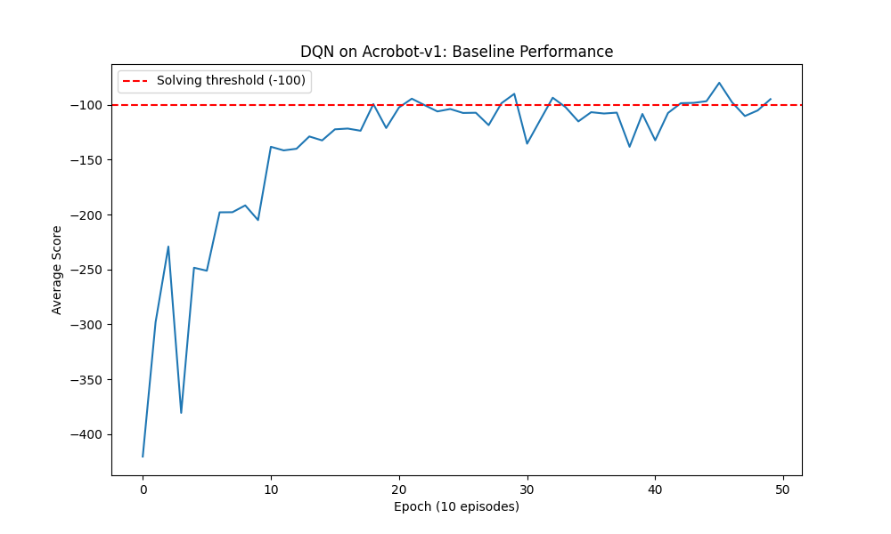
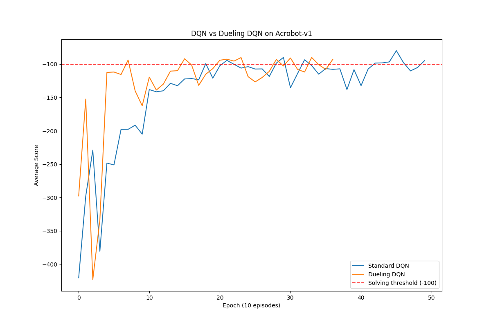
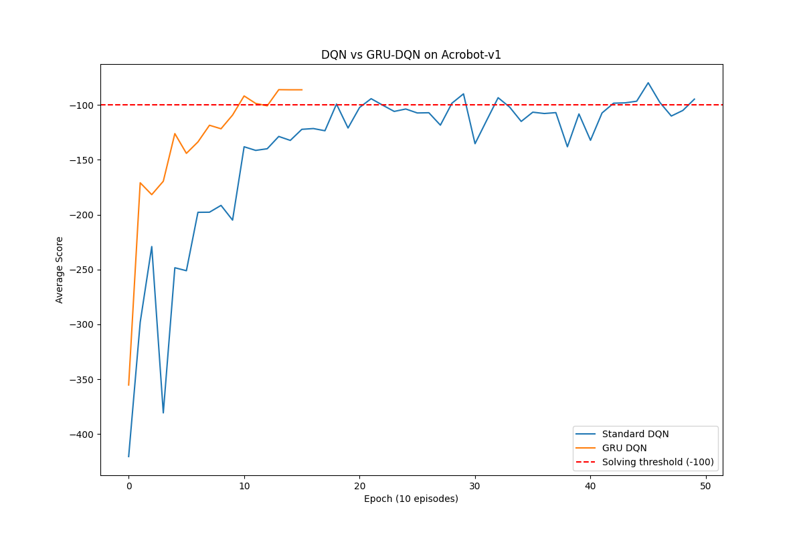
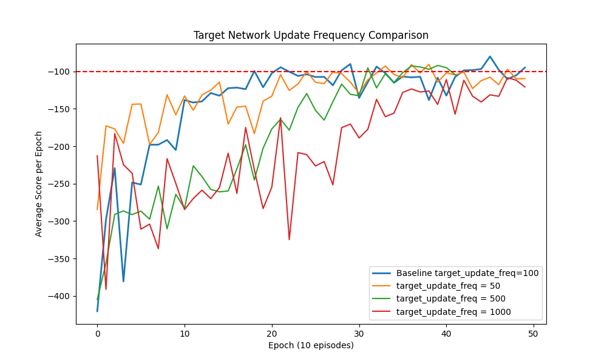
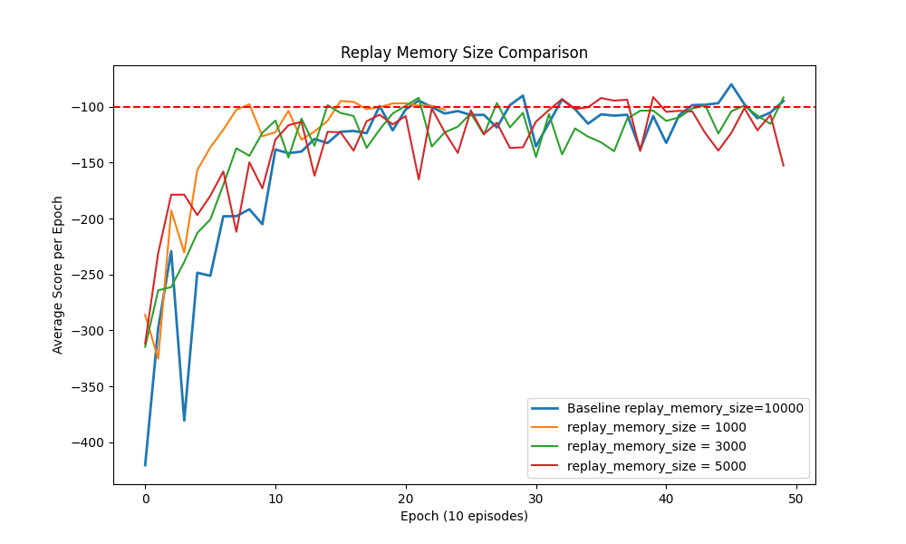
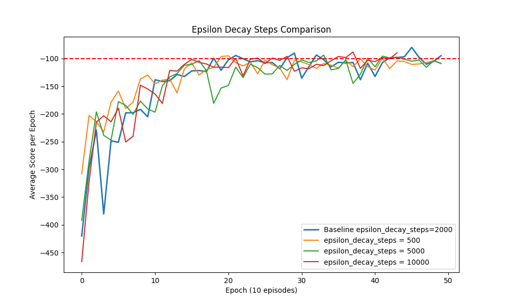
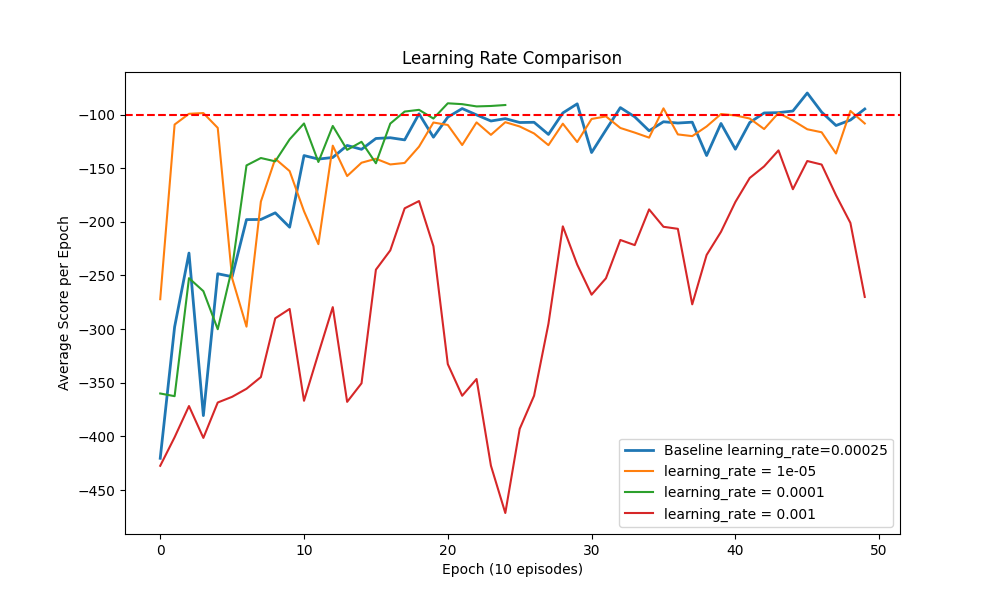

# rl-from-scratch
Reinforcement learning algorithms from scratch
## instal reuirements
pip install -r requirements.txt -q 

## DQN baseline                                                              
python experiments/dqn_baseline.py  

##DQN hyperparameter tuning                                                                                                                                                                                                                    
python experiments/dqn_hyperparam_tuning.py

## DQN vs Dueling DQN                                                                                                                                                                                                                           
python experiments/compare_dueling.py  

## DQN vs GRU DQN                                                            
python experiments/compare_gru.py  

## Results                                                                                                                                                                                                                                            
           
### DQN Baseline                                                                                                                                                                                                                                      
                                                                                                                                                                                                     
                                                                                                                                                                                                                                                        
### DQN vs Dueling DQN                                                                                                                                                                                                                              
                                                                                                                                                                                      
                                                                                                                                                                                                                                                        
### DQN vs GRU DQN                                                                                                                                                                                                                                    
                                                                                                                                                                                                 
                                                                                                                                                                                                                                                        
### Hyperparameter Sensitivity                                                                                                                                                                                                                        
                                                                                                                                                                             
                                                                                                                                                                                    
                                                                                                                                                                                 
  
